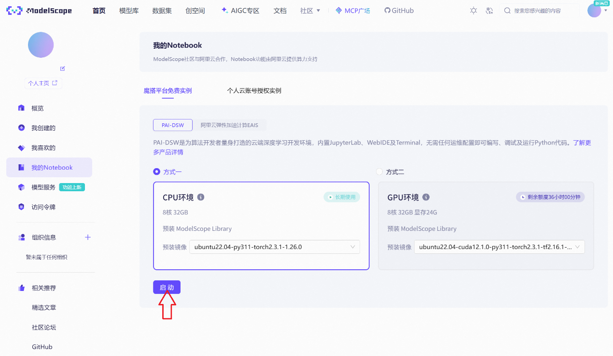

# <center>大语言模型部署</center> 

## 一、项目介绍
### 1.项目目的
- 在魔搭平台上完成大语言模型的部署；

- 针对2-3个不同的模型进行一些应用场景的测试(一词多义/一句多义)，并开展不同模型之间的横向对比。

### 2.所用大语言模型
 - [通义千问Qwen-7B-Chat](https://www.modelscope.cn/models/qwen/Qwen-7B-Chat/summary)

 - [智谱chatglm3-6b](https://www.modelscope.cn/models/ZhipuAI/chatglm3-6b/summary)

 - [百川2-7B-对话模型](https://www.modelscope.cn/models/baichuan-inc/Baichuan2-7B-Chat/summary)

 ### 3.应用场景
- 请说出以下两句话区别在哪里？ ①冬天：能穿多少穿多少 ②夏天：能穿多少穿多少

- 请说出以下两句话区别在哪里？单身狗产生的原因有两个，一是谁都看不上，二是谁都看不上

- 他知道我知道你知道他不知道吗？ 这句话里，到底谁不知道\n

- 明明明明明白白白喜欢他，可她就是不说。 这句话里，明明和白白谁喜欢谁？

- 领导：你这是什么意思？ 小明：没什么意思。意思意思。 领导：你这就不够意思了。 小明：小意思，小意思。领导：你这人真有意思。 小明：其实也没有别的意思。 领导：那我就不好意思了。 小明：是我不好意思。请问：以上“意思”分别是什么意思。


## 二、环境配置(以Linux操作系统为例)
### 1.平台的搭建
首先在魔搭社区上注册账号并绑定阿里云账号来获取所需的CPU资源


启动CPU环境


进入对应界面，点击Terminal图标，打开终端命令行环境


进入如下界面


### 2.conda环境
**首先查看是否已存在conda环境**
```
cd /opt/conda/envs
若无则会显示“没有那个文件或目录”
```

**conda环境的配置(若无)**
```
wget https://repo.anaconda.com/miniconda/Miniconda3-latest-Linux-x86_64.sh
bash Miniconda3-latest-Linux-x86_64.sh -b -p /opt/conda
echo 'export PATH="/opt/conda/bin:$PATH"' >> ~/.bashrc
source ~/.bashrc
conda --version
```

**环境的激活**
```
conda create -n qwen_env python=3.10 -y
source /opt/conda/etc/profile.d/conda.sh
conda activate qwen_env
```

### 3.基础依赖
**基础环境的配置**
```
pip install \
  torch==2.3.0+cpu \
  torchvision==0.18.0+cpu \
  --index-url https://download.pytorch.org/whl/cpu
```

**基础依赖项的配置**

首先检查pip是否能正常联网
```
pip install -U pip setuptools wheel
```

相关依赖项
```
# 安装基础依赖（兼容 transformers 4.33.3 和 neuralchat）
pip install \
  "intel-extension-for-transformers==1.4.2" \
  "neural-compressor==2.5" \
  "transformers==4.33.3" \
  "modelscope==1.9.5" \
  "pydantic==1.10.13" \
  "sentencepiece" \
  "tiktoken" \
  "einops" \
  "transformers_stream_generator" \
  "uvicorn" \
  "fastapi" \
  "yacs" \
  "setuptools_scm"

# 安装 fschat（需要启用 PEP517 构建）
pip install fschat --use-pep517
```

可选依赖项
```
# 安装tqdm、huggingface-hub等增强体验
pip install tqdm huggingface-hub
```


## 三、大模型的部署及调用
### 1.大模型的部署

切换到数据目录
```
cd /mnt/data
```

下载相应大模型
```
git clone https://www.modelscope.cn/qwen/Qwen-7B-Chat.git
git clone https://www.modelscope.cn/ZhipuAI/chatglm3-6b.git
git clone https://www.modelscope.cn/baichuan-inc/Baichuan2-7B-chat.git
```

### 2.大模型的调用

切换工作目录
```
cd /mnt/workspace
```

编写推理脚本 run_qwen_cpu.py / run_zhipu_cpu.py / run_baichuan_cpu.py
```
from transformers import TextStreamer, AutoTokenizer, AutoModelForCausalLM

model_name = "/mnt/data/YourModleName"  # 本地路径
# /mnt/data/Qwen-7B-Chat
# /mnt/data/chatglm3-6b
# /mnt/data/Baichuan2-7B-chat

prompt = "YourQuestion"

tokenizer = AutoTokenizer.from_pretrained(
    model_name,
    trust_remote_code=True
)

model = AutoModelForCausalLM.from_pretrained(
    model_name,
    trust_remote_code=True,
    torch_dtype="auto"  # 自动选择 float32/float16（根据模型配置）
).eval()

inputs = tokenizer(prompt, return_tensors="pt").input_ids

streamer = TextStreamer(tokenizer)
outputs = model.generate(inputs, streamer=streamer, max_new_tokens=500)
```

运行实例
```
python run_qwen_cpu.py
python run_zhipu_cpu.py
python run_baichuan_cpu.py
```